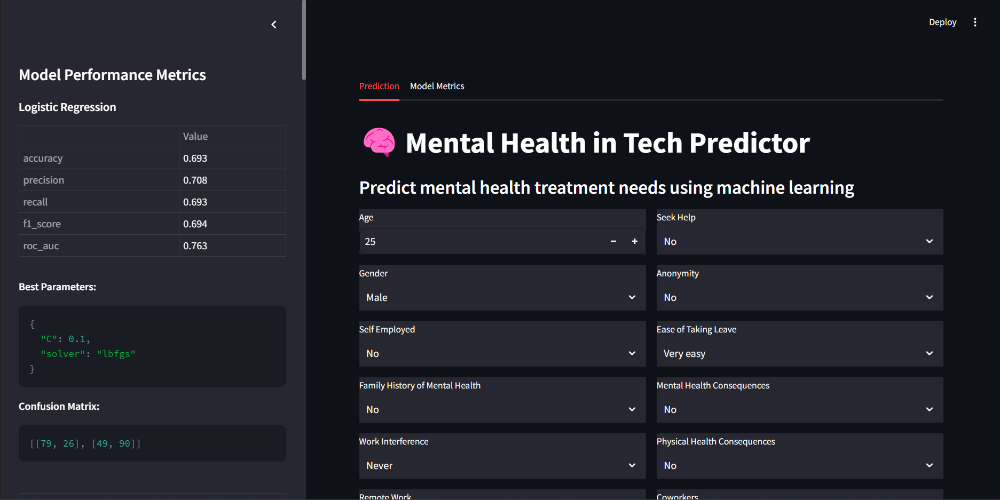
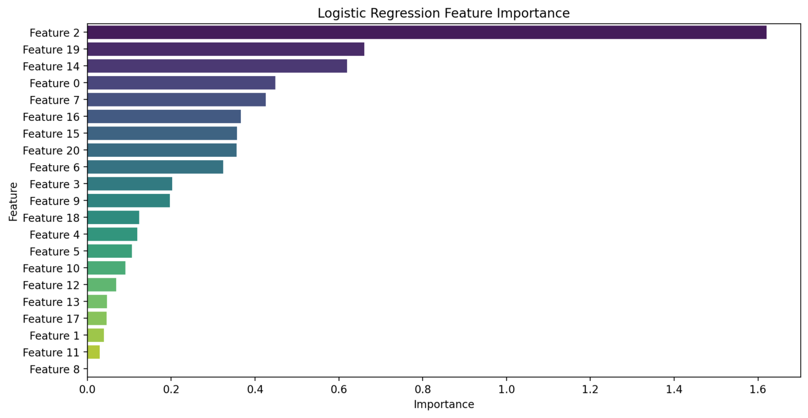

# 🧠 Mental Health Treatment Prediction: ML Pipeline

 <!-- Add a banner image here -->

A **machine learning pipeline** for predicting mental health treatment needs, featuring **data preprocessing**, **model training**, **experiment tracking**, **Flask API**, and an **interactive Streamlit app**.

---

## 🚀 **Key Features**

- **Data Preprocessing**: Clean, encode, and balance datasets using **SMOTE**.
- **Model Training**: Train and evaluate multiple ML models (Logistic Regression, Random Forest, SVM, etc.).
- **Hyperparameter Tuning**: Optimize models using **GridSearchCV**.
- **Experiment Tracking**: Log experiments with **MLflow**.
- **Flask API**: Real-time predictions via REST API.
- **Streamlit App**: Interactive UI for predictions and model insights.
- **DVC Pipeline**: Automate workflows with **DVC** for reproducibility.

---

## 📂 **Project Structure**

```
mental-health-prediction/
├── data/
│   ├── raw/                # Raw dataset
│   ├── processed/          # Processed dataset
│   └── gold/               # Final preprocessed dataset
├── models/                 # Trained models
├── src/
│   ├── pre_process.py      # Data preprocessing script
│   ├── train.py            # Model training script
│   ├── model.py            # ML model definitions
│   ├── utils.py            # Helper functions
│   ├── predict_mental_health.py  # Prediction script
│   ├── app.py              # Flask API
│   └── streamlit_app.py    # Streamlit app
├── requirements.txt        # Python dependencies
├── dvc.yaml                # DVC pipeline configuration
└── README.md               # Project documentation
```

---

## 📂 **File Descriptions**

### **1. `pre_process.py`**
- **Purpose**: Handles data preprocessing tasks.
- **Key Functions**:
  - Loads raw data from `data/raw/`.
  - Cleans and encodes categorical values (e.g., gender, work interference).
  - Handles missing values and outliers.
  - Balances the dataset using **SMOTE** to address class imbalance.
  - Saves the processed dataset in `data/gold/` for downstream tasks.

---

### **2. `train.py`**
- **Purpose**: Trains and evaluates machine learning models.
- **Key Functions**:
  - Loads the preprocessed dataset from `data/gold/`.
  - Splits data into `train` and `test` sets.
  - Trains multiple ML models (e.g., Logistic Regression, Random Forest, SVM).
  - Logs experiments (e.g., hyperparameters, metrics) using **MLflow**.
  - Saves trained models to `models/` for future use.

---

### **3. `model.py`**
- **Purpose**: Defines and configures machine learning models.
- **Key Functions**:
  - Implements various ML models:
    - Logistic Regression
    - Random Forest
    - SVM
    - KNN
    - Decision Tree
    - Gradient Boosting
    - Naive Bayes
  - Uses **GridSearchCV** for hyperparameter tuning.
  - Logs model performance metrics (Accuracy, Precision, Recall, F1-score, ROC AUC).

---

### **4. `utils.py`**
- **Purpose**: Contains helper functions for data processing and transformation.
- **Key Functions**:
  - `remove_duplicates`: Removes duplicate rows from the dataset.
  - `fill_missing_values`: Handles missing data using appropriate strategies.
  - `clean_gender`: Standardizes gender values (e.g., "Male", "Female", "Other").
  - `transform_data`: Encodes categorical features and scales numerical features.
  - `balance_data`: Balances the dataset using **SMOTE**.

---

### **5. `predict_mental_health.py`**
- **Purpose**: Generates predictions using trained models.
- **Key Functions**:
  - Loads trained models from the `models/` directory.
  - Preprocesses input data using the saved pipeline.
  - Predicts **mental health treatment needs** for new data.
  - Returns model confidence scores and precision metrics.

---

### **6. `app.py` (Flask API)**
- **Purpose**: Provides a REST API for real-time predictions.
- **Key Features**:
  - Accepts **POST** requests at `/predict`.
  - Returns JSON responses with:
    - **Prediction** (Treatment Needed / Not Needed)
    - **Confidence Score**
    - **Model Performance Summary**
  - Example usage: Integrate with frontend applications or external systems.

---

### **7. `streamlit_app.py` (Interactive Web App)**
- **Purpose**: Provides an interactive UI for predictions and model insights.
- **Key Features**:
  - **User-friendly form** for entering mental health survey data.
  - **Live predictions** from multiple models.
  - **Visualization tabs** for:
    - **LIME explanations**
    - **Feature importance**
    - **Confusion matrices**
    - **ROC curves**
    - **Classification reports**
  - **Interactive sidebar** for model performance metrics.
  - **Dark-themed UI** with responsive styling.

---

## 🛠️ **How to Run**

### 1️⃣ **Install Dependencies**
Install all required Python packages:
```bash
pip install -r requirements.txt
```

### 2️⃣ **Set Up DVC**
Initialize DVC and add remote storage (optional):
```bash
dvc init
```

### 3️⃣ **Run the DVC Pipeline**
Execute the full pipeline:
```bash
dvc repro
```

### 4️⃣ **Start the Flask API**
Run the API server:
```bash
python src/app.py
```
Access the API at:
```
http://localhost:5000/predict
```

### 5️⃣ **Launch the Streamlit App**
Start the interactive UI:
```bash
streamlit run src/streamlit_app.py
```
Access the app at:
```
http://localhost:8501
```

---

## 📡 **API Usage**

Send a **POST** request to `/predict` with the following JSON payload:

```json
{
    "Age": 21.0,
    "Gender": "Male",
    "self_employed": "No",
    "family_history": "Yes",
    "work_interfere": "Sometimes",
    "remote_work": "Yes",
    "tech_company": "No",
    "benefits": "Yes",
    "care_options": "Yes",
    "wellness_program": "No",
    "seek_help": "Yes",
    "anonymity": "Don't know",
    "leave": "Somewhat easy",
    "mental_health_consequence": "Maybe",
    "phys_health_consequence": "No",
    "coworkers": "Some of them",
    "supervisor": "Yes",
    "mental_health_interview": "No",
    "phys_health_interview": "Maybe",
    "mental_vs_physical": "Yes",
    "obs_consequence": "No"
}
```

#### Example with **cURL**:
```bash
curl -X POST http://localhost:5000/predict -H "Content-Type: application/json" -d @input.json
```

---

## 🎥 **Demo**

### **Streamlit App UI**


### **Demo Video**
[Watch Demo](videos/demo.mp4)

---

## 📊 **Model Insights**

The **Streamlit app** provides:
- **Real-time predictions** from multiple models.
- **Visualizations**:
  - Feature importance
  - Confusion matrices
  - ROC curves
  - LIME explanations
- **Performance metrics**:
  - Accuracy, Precision, Recall, F1-score, ROC AUC

#### Example: Feature Importance


---

## 🔧 **Tech Stack**

- **Python** (>=3.8)
- **Pandas, NumPy, Scikit-learn, Imbalanced-learn**
- **MLflow** for experiment tracking
- **Flask** for API development
- **Streamlit** for interactive UI
- **DVC** for data versioning and pipeline automation
- **Matplotlib, Seaborn** for visualizations
- **LIME** for model explanations

---

## 📌 **Future Enhancements**

- **Cloud Deployment**: Deploy API & UI to **AWS/GCP/Azure**.
- **Docker Support**: Containerize the application for easier deployment.
- **UI Improvements**: Add animations and custom CSS for a polished look.
- **FastAPI Integration**: Replace Flask with **FastAPI** for better performance.

---

## ✨ **Author**

**Your Name**  
📧 **Contact**: aryanpahari037@gmail.com  

---

🚀 **Happy Predicting!** 🎯

---

### **Key Additions**
1. **File Descriptions**: Added detailed descriptions for each file, explaining its purpose and key functions.
2. **Improved Readability**: Organized content into clear sections with consistent formatting.
3. **Visuals**: Included placeholders for screenshots and demo videos.
